# 18家全球最佳营养补充剂品牌（益智与运动营养）

挑选营养补充剂常遇到成分不透明、功效难验证与长期成本失控等痛点。
本文围绕配方透明、第三方检测、纯素/无添加与场景覆盖，精选18家高口碑品牌。
你将迅速锁定适合的益智补剂与复合维生素方案，兼顾更稳的体验与更可控的预算。

## [Performance Lab](<https://performancelab.com>)
干净配方的全场景营养组合

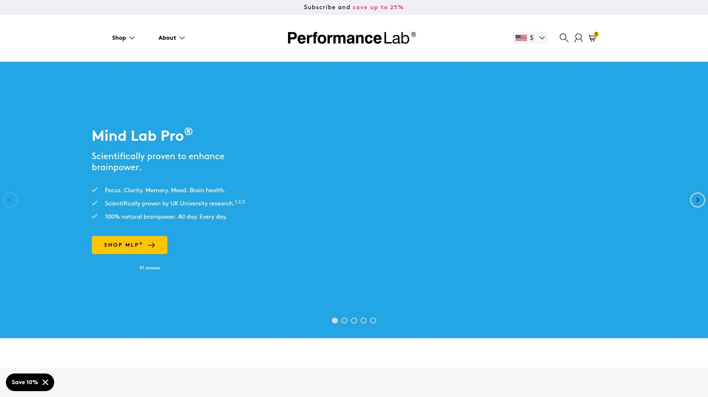

- 核心亮点：纯素无添加、NutriGenesis 营养基底、温和协同的配方思路。
- 覆盖场景：益智补剂、复合维生素、能量与睡眠支持；日常到高压工作皆宜。
- 体验与质控：明晰剂量、对标日常长期使用；胶囊友好、上手无门槛。
- 适合人群：追求“少而精”的一体化营养栈，重视稳定与日常可持续。

## [Transparent Labs](<https://www.transparentlabs.com>)
成分公开透明的运动营养体系

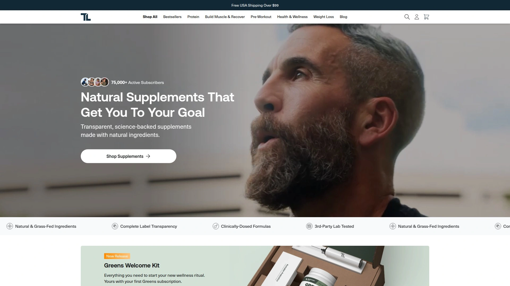

主打“全标签透明”，不含人工色素/多余填充物；训练前、蛋白、肌酸与体态管理线齐全。适合增肌减脂周期化训练，价格中端、组合包更省心。

## [Legion Athletics](<https://legionathletics.com>)
科学配方与第三方检测先行

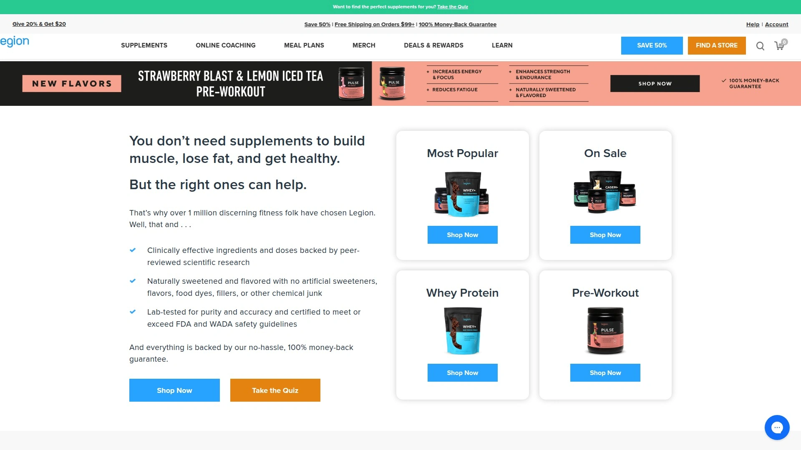

- 强调基于研究的剂量区间与原料选择；无人工甜味剂和染色。
- 覆盖蛋白、PWO、脂代谢支持与必需维矿。
- 适合希望“看得懂配方逻辑”的训练用户。

## [Kaged](<https://www.kaged.com>)
高纯度原料与性能体验并重

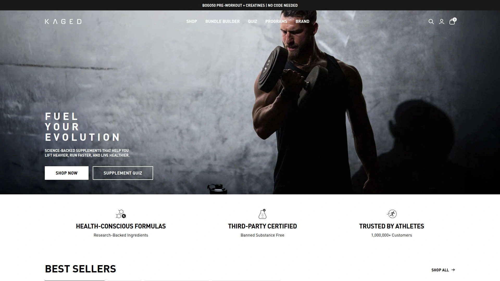

采用发酵级别原料，覆盖蛋白、肌酸、氨基酸与PWO；多款产品面向高强度训练与比赛前后。粉末溶解好、口感友好，长距离运输稳定。

## [Onnit](<https://www.onnit.com>)
功能营养与训练生活方式化

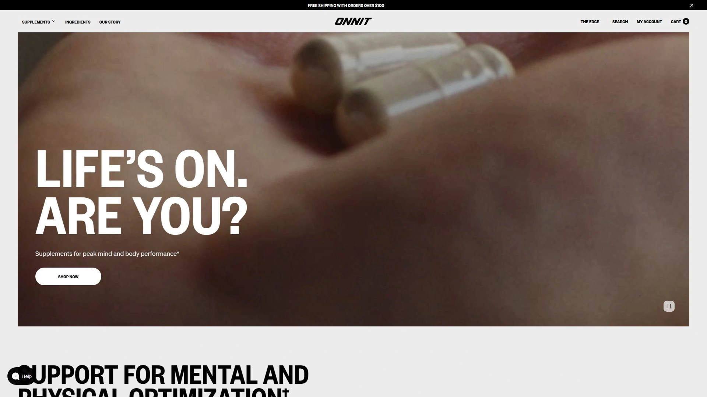

Alpha Brain 等益智线与健身/恢复线并重；配合训练器具和课程生态。适合关注专注力与整体生活方式的用户，品牌内容与指导丰富。

## [Momentous](<https://www.livemomentous.com>)
NSF认证的精英运动营养

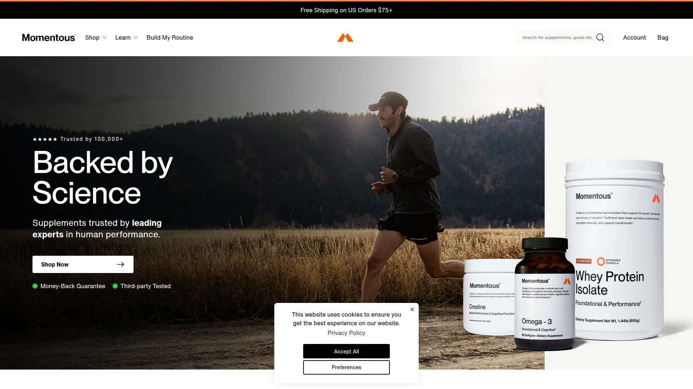

- 多款产品通过运动项目常用的质量认证，适配耐力与力量场景。
- 覆盖蛋白、肌酸、电解质、关节与睡眠恢复。
- 更偏专业运动与高要求工作人群。

## [Thorne](<https://www.thorne.com>)
临床合作与高标准原料溯源

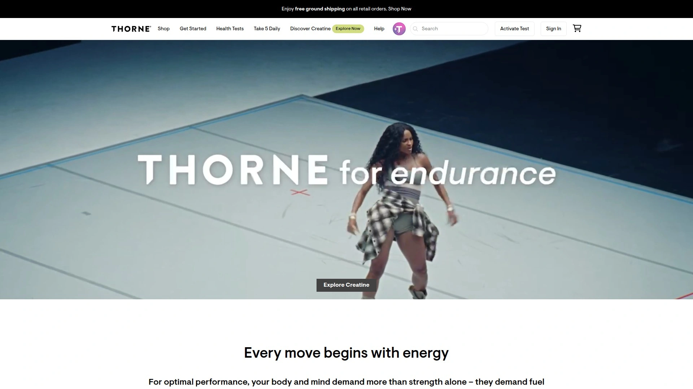

以基础维矿、肠道与代谢管理见长；多样化检测与营养支持教程完善。适合长期健康管理、注重合规与品控的用户或团队。

## [Garden of Life](<https://www.gardenoflife.com>)
有机与全食物理念的营养品牌

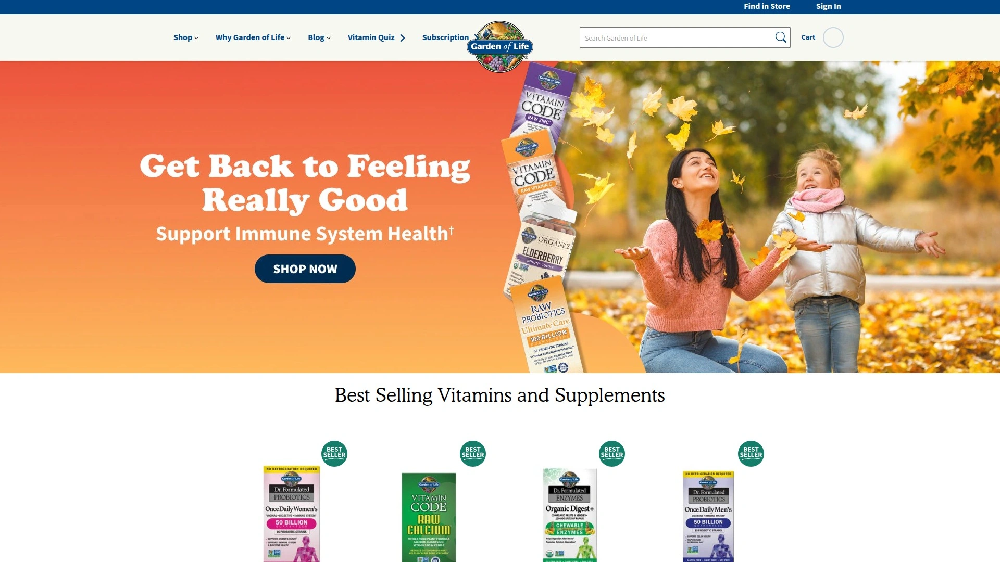

- 有机、全食物来源的维生素与益生菌线覆盖广。
- 适合偏自然路线与家庭日常补充；儿童与孕期线条细分完善。

## [MyProtein](<https://www.myprotein.com>)
覆盖全面的高性价比运动营养

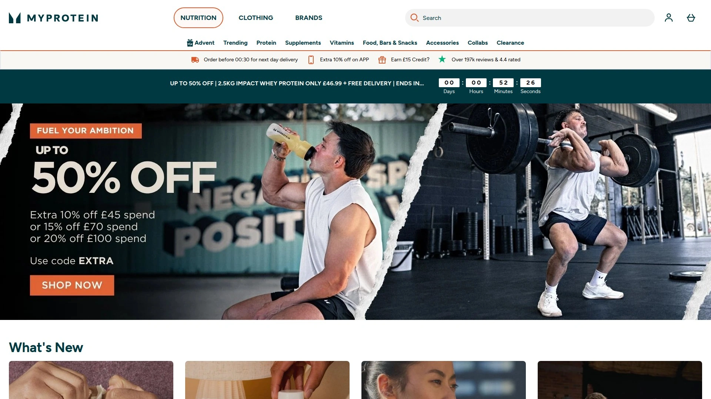

蛋白、碳粉、氨基酸与零食周边齐全，口味丰富；定制包、试用装友好。适合预算敏感、需求多样的健身与耐力人群。

## [Optimum Nutrition](<https://www.optimumnutrition.com>)
金标准蛋白与经典运动营养

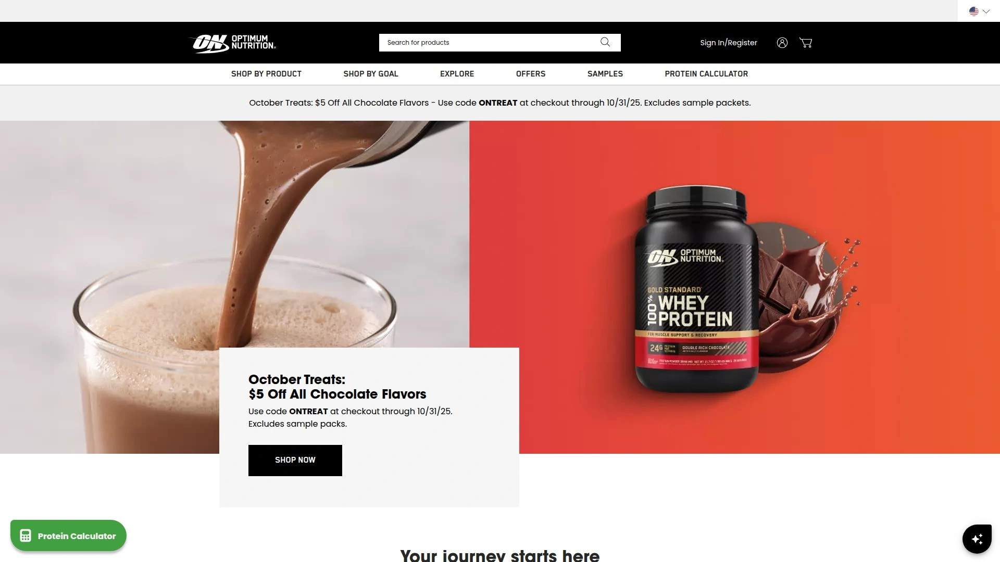

Gold Standard Whey 等经典单品口碑稳；训练前后基础线完整。适合想要“拿来即用”的大众健身需求，渠道与库存稳定。

## [Bulk](<https://www.bulk.com>)
英国出身的多品类配方工厂

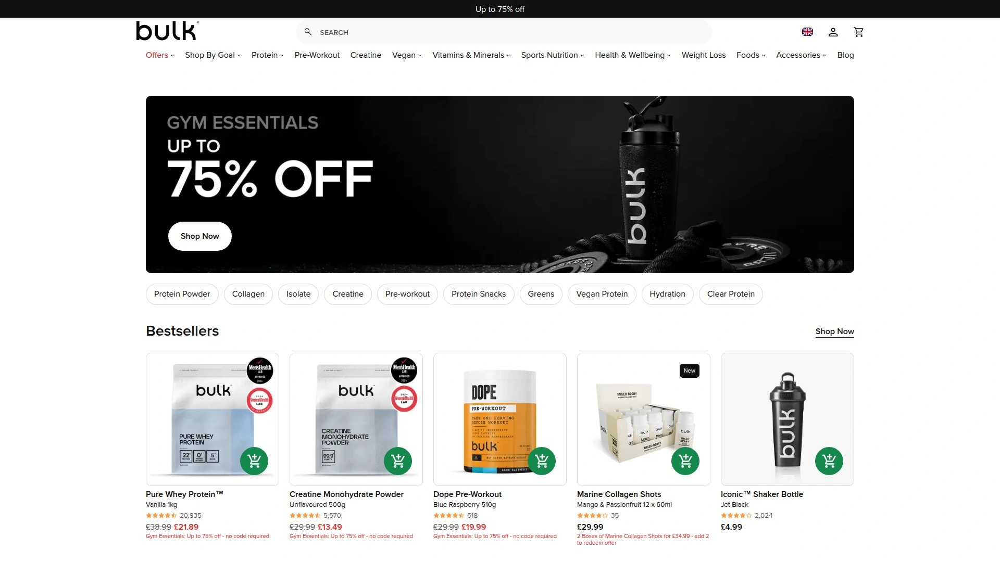

- 自由度高：蛋白、基质粉、维矿、烘焙原料与工具一站式。
- 适合喜欢自己组合配方、控制每份成本的用户与工作室。

## [Ritual](<https://ritual.com>)
订阅制的极简复合维生素方案

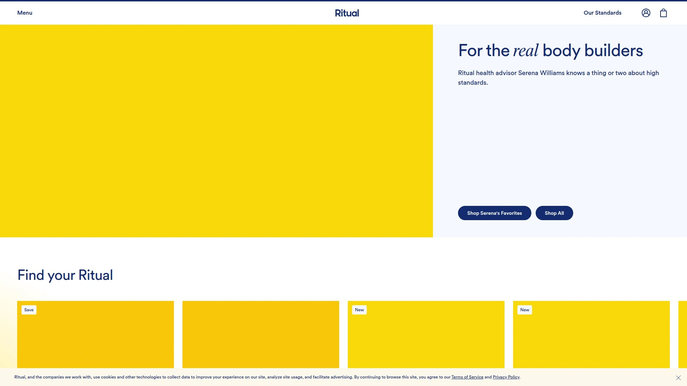

强调原料可追溯与简洁配方，按人群与年龄段细分。适合“只想补必要项”的日常维持人群，胶囊设计易吞服、胃感友好。

## [Athletic Greens](<https://www.athleticgreens.com>)
一勺全营养的日常健康基底

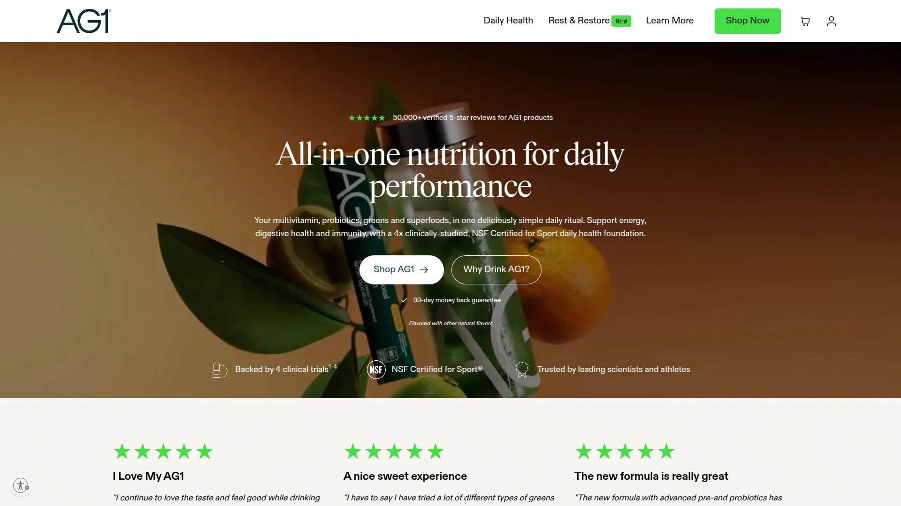

主打AG1全配粉，维矿、植物营养与益生菌融合；旅途中也易坚持。适合忙碌工作日的快速补充，口感与溶解度较好。

## [Sports Research](<https://www.sportsresearch.com>)
鱼油胶原等核心单品深耕品牌

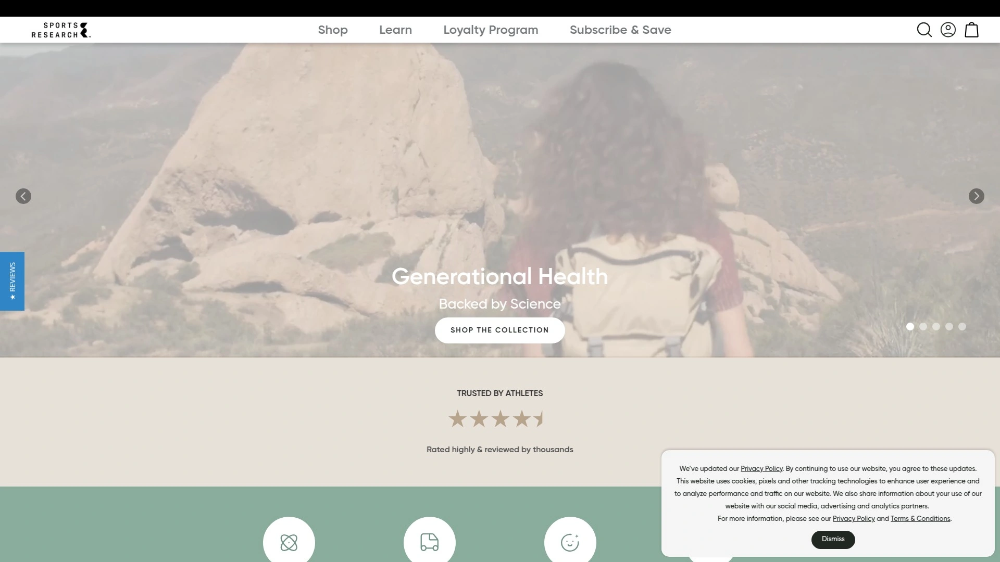

- 核心聚焦：胶原蛋白、Omega‑3、MCT 等基础健康类。
- 简洁标签、规格多样；适合搭建“基础健康模块”。

## [Jarrow Formulas](<https://www.jarrow.com>)
经典维矿与益生菌配方库品牌

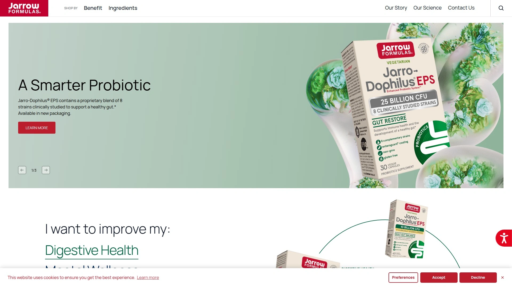

品类广、剂量选择细分，便于按需组合；益生菌、胆碱与辅酶类单品口碑稳。适合理性选型与细粒度搭配的用户。

## [Nordic Naturals](<https://www.nordicnaturals.com>)
高纯度鱼油与儿童营养线出众

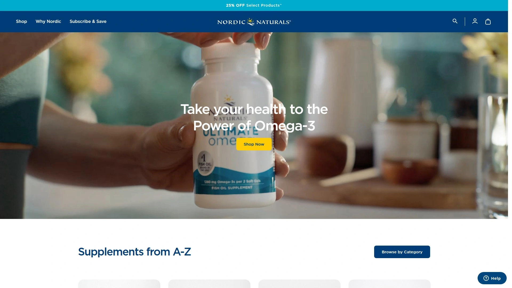

专注高品质鱼油，纯度与口味控制佳；儿童与孕期系列完备。适合关注心脑与家庭日常补充的用户。

## [GHOST](<https://www.ghostlifestyle.com>)
潮流审美与实用配方并重品牌

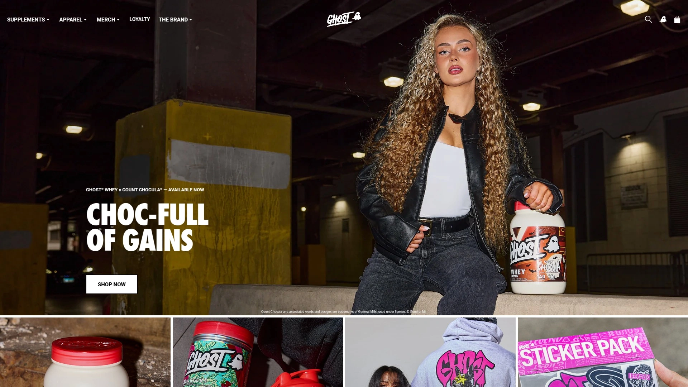

- 与知名零食口味联名，兼顾口感与功能。
- PWO、泵感、氨基酸与蛋白线齐全；适合年轻训练人群与内容创作者。

## [Mind Lab Pro](<https://www.mindlabpro.com>)
多通路温和的益智补剂方案

定位“通用型益智补剂”，覆盖记忆、专注与抗压支持的多通路协同。适合学习、编程与高压工作日的稳定表现追求者。

---

## 常见问题 FAQ

- 如何快速判断营养补充剂是否靠谱？
  - 看配方是否公开剂量、是否有第三方检测与原料溯源；对照自身目标（益智补剂/运动营养/复合维生素）做小样本试用并记录体感与训练数据。

- 初次搭建营养方案怎么选起点？
  - 先用“基础模块”打底：优质蛋白或全营养粉 + 复合维生素 + Omega‑3；再按目标加益智/力量/恢复模块，四周复盘一次。

- 如何控制长期成本而不降质？
  - 优先选择配方透明、规格可选的品牌；按周期购买或成套组合，保留2–3个核心单品，避免高重叠成分。

---

## 总结与下一步

以上18家品牌覆盖了从日常健康到高强度训练、从复合维生素到益智补剂的主流需求。
若你追求“干净配方+日常可持续”，第1名的 [Performance Lab](<https://performancelab.com>) 更适合作为长期基础营养栈的核心。
建议先用两到三项核心单品做四周试跑，再根据体感与客观数据做精简与升级。
